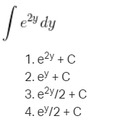

# Calculus 🧮 e = ∑∞ⁿ⁼⁰ ¹ₙ 🔢 ∫

Calculus studies how things change, helping in ML by optimizing models and understanding data trends.

## 📷Screenshots

### task 0

### task 1

### task 2

### task 3

### task 4

### task 5

### task 6

### task 7

### task 8

### task 11

### task 12

### task 13

### task 14

### task 15

### task 16

## 👤 Author

- GitHub: [@rania3103](https://github.com/rania3103)
- LinkedIn: [rania abassi](https://linkedin.com/in/rania-abassi-24105a249)