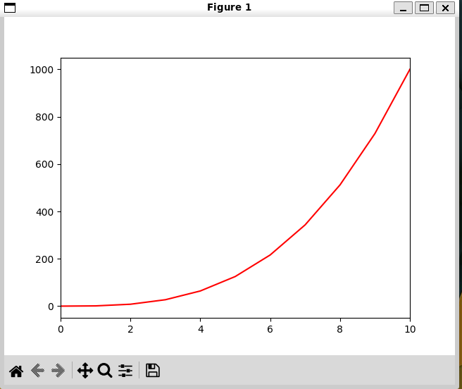
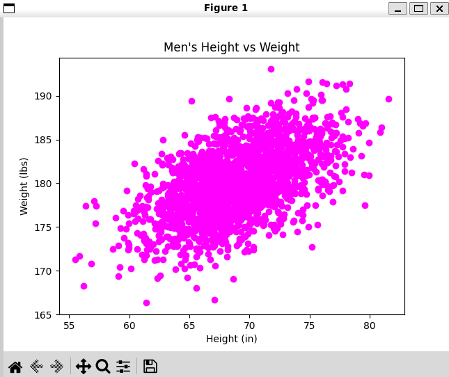
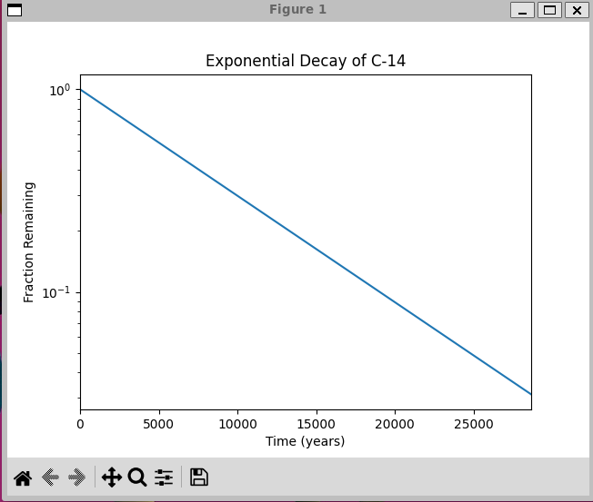
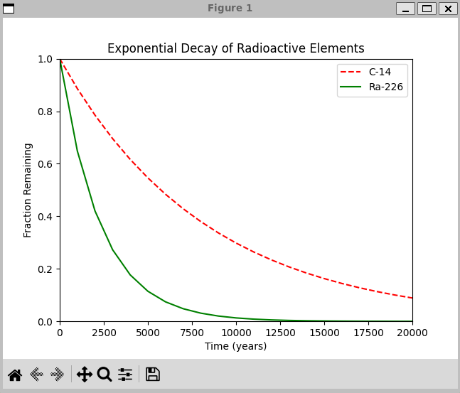
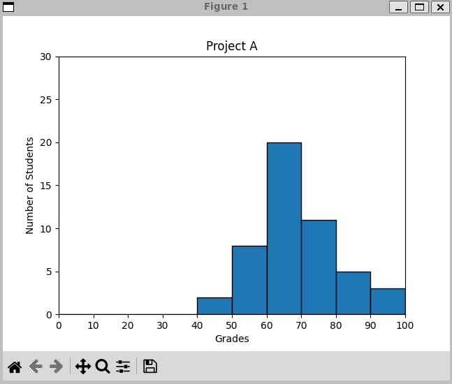
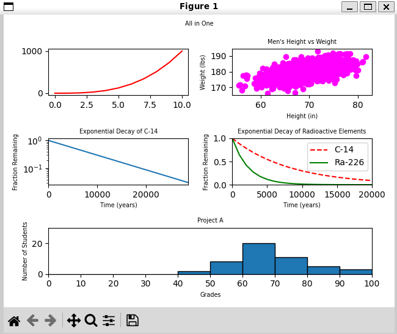

# Plotting 📈 📊  📉

**Plotting data** imagine you have numbers and you want to see how they relate to each other. Matplotlib helps you make pictures of these numbers so you can understand them better. you can make different types of pictures like <b>Line graph</b> , <b>Scatter</b> , <b>Bar graph</b>

## 📷Screenshots

## 👤 Author

- GitHub: [@rania3103](https://github.com/rania3103)
- LinkedIn: [rania abassi](https://linkedin.com/in/rania-abassi-24105a249)